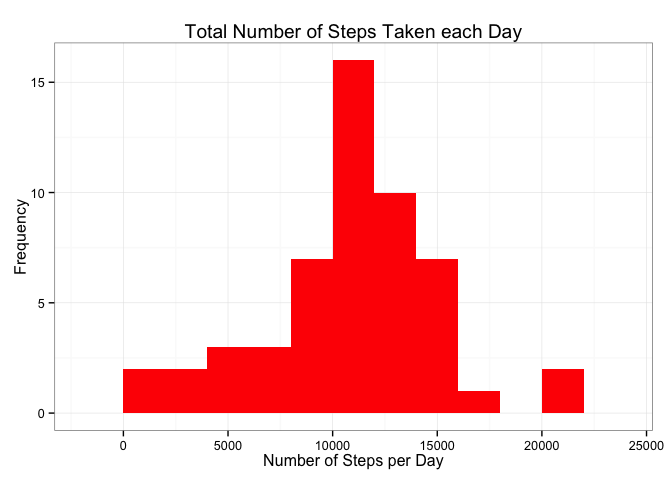
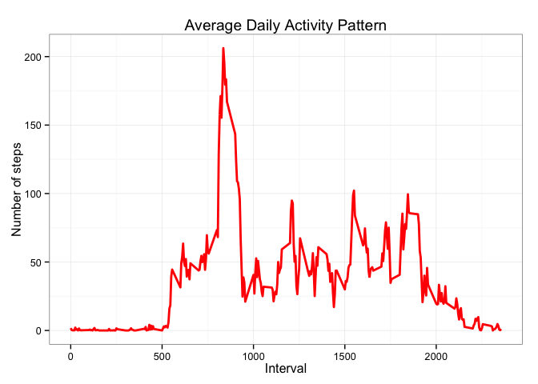
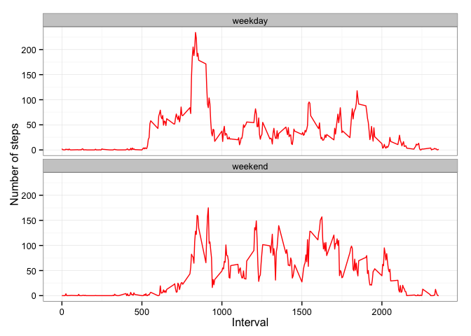

# Reproducible Research: Peer Assessment 1
Habibu Atib  
February 7, 2016  
## Introduction
This report is written as part of ***Reproducible Research: peer assessment 1.*** The entire report is generated using **a single R markdown** document that be processed by **knitr** then finally transformed into **an HTML** file.  
  
This assignment makes use of data from a personal activity monitoring device. This device collects data at 5 minute intervals through out the day. The data consists of two months of data from an anonymous individual collected during the months of October and November, 2012 and include the number of steps taken in 5 minute intervals each day.  
   
The dataset for this assignment is available for download from the course website:  

- [Activity monitoring data](https://d396qusza40orc.cloudfront.net/repdata%2Fdata%2Factivity.zip) [52K]  

The variables included in this dataset are:

- **steps:** Number of steps taking in ***a 5-minute interval*** (missing values are coded as 𝙽𝙰)
- **date:** The date on which the measurement was taken in ***YYYY-MM-DD*** format
- **interval:** Identifier for the 5-minute interval in which measurement was taken  
  
The dataset is stored in ***a comma-separated-value*** (CSV) file and there are a total of ***17,568*** observations in this dataset.

###Set R Environment
Throughout this report we have embedded our code as part of the output.  
In order for other people to read our our code chunks in the R markdown document, we had to set **echo = TRUE**

```r
library(knitr)
opts_chunk$set(echo = TRUE, results='hold')
```

### Load libraries
The libraries used for this analysis are:  

- data.table and 
- ggplot2 are the

```r
library(data.table)
```

```
## Warning: package 'data.table' was built under R version 3.1.3
```

```r
library(ggplot2)
```

```
## Warning: package 'ggplot2' was built under R version 3.1.3
```
## Loading and preprocessing the data

1. **Load data**

```r
unzip("activity.zip")
activityData<-read.csv("activity.csv",header = TRUE, sep = ",")
```

2. **Preprocess the data**

Transform date as ***Date*** and interval as ***Factor***

```r
activityData$date <- as.Date(activityData$date, format = "%Y-%m-%d")
activityData$interval <- as.factor(activityData$interval)
```
**Summary of the input data**

```r
summary(activityData)
```

```
##      steps             date               interval    
##  Min.   :  0.00   Min.   :2012-10-01   0      :   61  
##  1st Qu.:  0.00   1st Qu.:2012-10-16   5      :   61  
##  Median :  0.00   Median :2012-10-31   10     :   61  
##  Mean   : 37.38   Mean   :2012-10-31   15     :   61  
##  3rd Qu.: 12.00   3rd Qu.:2012-11-15   20     :   61  
##  Max.   :806.00   Max.   :2012-11-30   25     :   61  
##  NA's   :2304                          (Other):17202
```

```r
str(activityData)
```

```
## 'data.frame':	17568 obs. of  3 variables:
##  $ steps   : int  NA NA NA NA NA NA NA NA NA NA ...
##  $ date    : Date, format: "2012-10-01" "2012-10-01" ...
##  $ interval: Factor w/ 288 levels "0","5","10","15",..: 1 2 3 4 5 6 7 8 9 10 ...
```

```r
head(activityData)
```

```
##   steps       date interval
## 1    NA 2012-10-01        0
## 2    NA 2012-10-01        5
## 3    NA 2012-10-01       10
## 4    NA 2012-10-01       15
## 5    NA 2012-10-01       20
## 6    NA 2012-10-01       25
```

## What is mean total number of steps taken per day?

1. **Total number of steps**


```r
totalStepsPerDay <-aggregate(steps ~ date, activityData, sum)
```

```r
summary(totalStepsPerDay)
```

```
##       date                steps      
##  Min.   :2012-10-02   Min.   :   41  
##  1st Qu.:2012-10-16   1st Qu.: 8841  
##  Median :2012-10-29   Median :10765  
##  Mean   :2012-10-30   Mean   :10766  
##  3rd Qu.:2012-11-16   3rd Qu.:13294  
##  Max.   :2012-11-29   Max.   :21194
```

2. **A histogram of the total number of steps taken each day**


```r
ggplot(totalStepsPerDay,aes(x = steps)) +
        geom_histogram(fill = "red", binwidth = 2000) +
        labs(title = "Total Number of Steps Taken each Day",
             x = "Number of Steps per Day",
             y = "Frequency") + theme_bw()
```



3. **Computer Mean and Median of the total number of steps taken each day**


```r
meanForSteps <- round(mean(totalStepsPerDay$steps), digits = 3)
medianForSteps <- median(totalStepsPerDay$steps)
```

- The mean is ***10766***
- The median is ***10765***


## What is the average daily activity pattern?

1. **Compute the average steps for each interval for all days**


```r
stepsPerInterval <- aggregate(steps ~ interval, activityData, mean)
```


```r
stepsPerInterval$interval <- 
        as.integer(levels(stepsPerInterval$interval)[stepsPerInterval$interval])
colnames(stepsPerInterval) <- c("interval", "steps")
```

2. **Plot the Average Number of Steps per Day by interval**


```r
ggplot(stepsPerInterval, aes(x=interval, y=steps)) + 
geom_line(color="red", size=1) +
labs(title="Average Daily Activity Pattern", x = "Interval", y="Number of steps") +
theme_bw()
```



3. **Find interval with most average**


```r
maxInterval <- stepsPerInterval[which.max(stepsPerInterval$steps),]
```

The maximum of steps is 206

## Imputing missing values

1. **Compute and report the total number of missing values:**


```r
missingVals <- sum(is.na(activityData$steps))
```

The total number of missing values are 2304


2. **The Strategy for dealing with the missing values in the dataset**


```r
newActivityData <- activityData
for(i in 1:nrow(newActivityData)){
        if(is.na(newActivityData$steps[i])){
                newActivityData$steps[i] <- (max(newActivityData$steps[i]) - min(newActivityData$steps[i]))
        }
}
```

3. **Create a dataset using the Strategy for dealing with missing values.**


```r
newTotalStepsPerDay <-aggregate(steps ~ date, newActivityData, sum)
```

4. **A histogram of the total number of steps taken each day**


```r
ggplot(newTotalStepsPerDay,aes(x = steps)) +
        geom_histogram(fill = "red", binwidth = 2000) +
        labs(title = "Total Number of Steps Taken each Day",
             x = "Number of Steps per Day",
             y = "Frequency") + theme_bw()
```


```r
newMeanForSteps <- round(mean(newTotalStepsPerDay$steps), digits = 3)
newMedianForSteps <- median(newTotalStepsPerDay$steps)
```

- The mean is ***10766***
- The median is ***10765***


## Are there differences in activity patterns between weekdays and weekends?

We performed the comparison using dataset without missing values


```r
weekdaysSteps <- function(data) {
    weekdaysSteps <- aggregate(data$steps, by=list(interval = data$interval),
                          FUN=mean, na.rm=T)
    # convert to integers for plotting
    weekdaysSteps$interval <- 
            as.integer(levels(weekdaysSteps$interval)[weekdaysSteps$interval])
    colnames(weekdaysSteps) <- c("interval", "steps")
    weekdaysSteps
}

databyWeekdays <- function(data) {
    data$weekday <- 
            as.factor(weekdays(data$date)) # weekdays
    weekendData <- subset(data, weekday %in% c("Saturday","Sunday"))
    weekdayData <- subset(data, !weekday %in% c("Saturday","Sunday"))

    weekendSteps <- weekdaysSteps(weekendData)
    weekdaySteps <- weekdaysSteps(weekdayData)

    weekendSteps$dayofweek <- rep("weekend", nrow(weekendSteps))
    weekdaySteps$dayofweek <- rep("weekday", nrow(weekdaySteps))

    databyWeekdays <- rbind(weekendSteps, weekdaySteps)
    databyWeekdays$dayofweek <- as.factor(databyWeekdays$dayofweek)
    databyWeekdays
}

dataWeekDays <- databyWeekdays(newActivityData)
```


```r
ggplot(dataWeekDays, aes(x=interval, y=steps)) + 
        geom_line(color="red") + 
        facet_wrap(~ dayofweek, nrow=2, ncol=1) +
        labs(x="Interval", y="Number of steps") +
        theme_bw()
```


